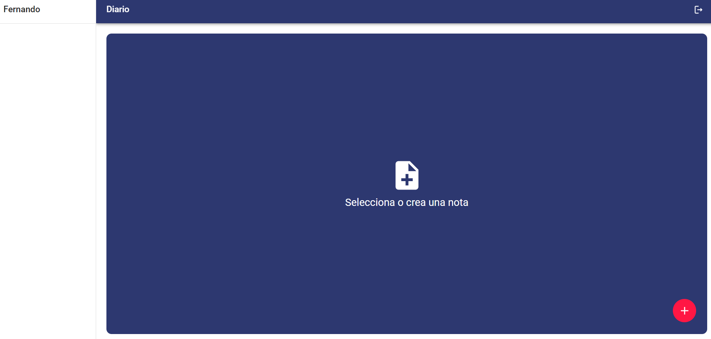
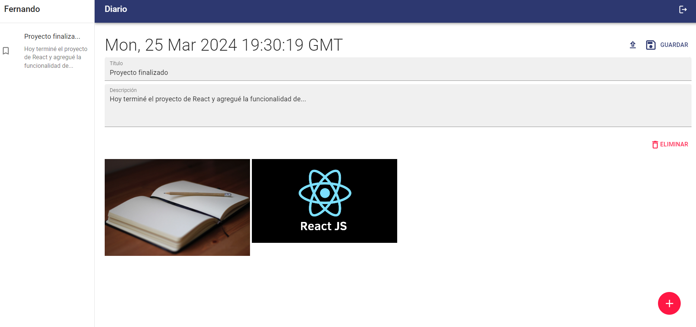

# Journal
Journal web app built with React.

## Features
* Login with email and password.
* Login with Google.
* Note registration with:
    - Title.
    - Description.
    - Images.
* Editing and deletion of notes.

## Installation
1. Clone the repository
```bash
git clone https://github.com/Fernando-LRz/journal.git
``` 
2. Navigate to the project directory
```bash
cd journal
```
3. Install dependencies
```bash
npm install
```

## Configuration
* A Firebase account and a Cloudinary account are required. Environment variables for both accounts must be added to a .env file. There is a sample .env file in the project.

## Run
```bash
npm run dev
```

## Images
| Login                                                            |
| ---------------------------------------------------------------- |
|            |

| SignUp                                                           |
| ---------------------------------------------------------------- |
|           |

| Home                                                             |
| ---------------------------------------------------------------- |
|             |

| Create note                                                      |
| ---------------------------------------------------------------- |
|         |
